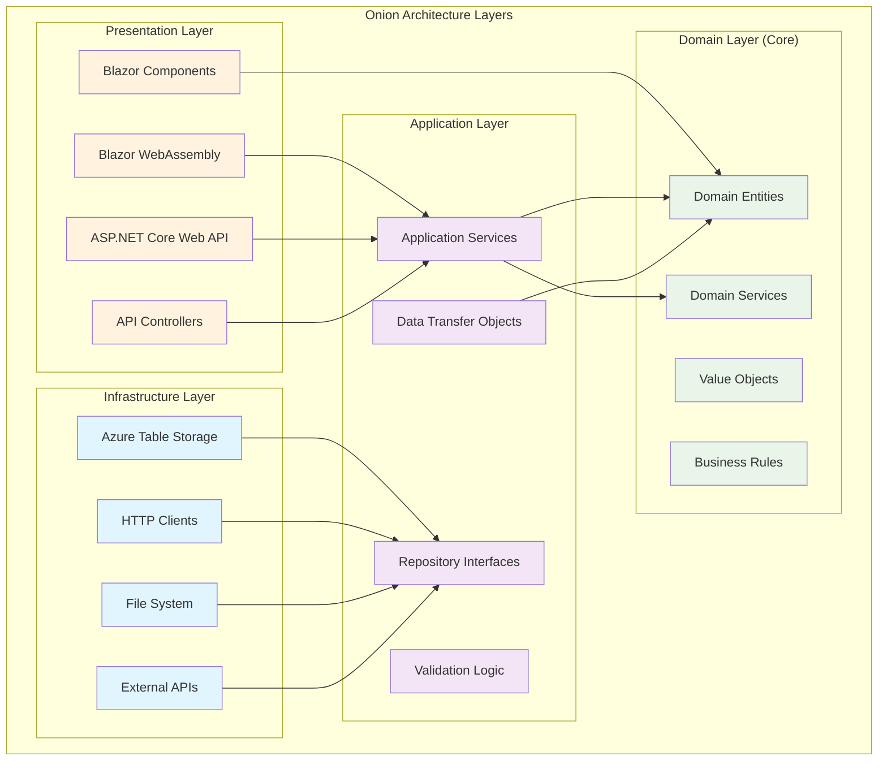

```mermaid
graph TB
    subgraph "Onion Architecture Layers"
        subgraph "Infrastructure Layer"
            Azure[Azure Table Storage]
            Http[HTTP Clients]
            Files[File System]
            External[External APIs]
        end
        
        subgraph "Application Layer"
            Services[Application Services]
            Interfaces[Repository Interfaces]
            DTOs[Data Transfer Objects]
            Validation[Validation Logic]
        end
        
        subgraph "Domain Layer (Core)"
            Entities[Domain Entities]
            ValueObjects[Value Objects]
            BusinessRules[Business Rules]
            DomainServices[Domain Services]
        end
        
        subgraph "Presentation Layer"
            BlazorUI[Blazor WebAssembly]
            WebAPI[ASP.NET Core Web API]
            Controllers[API Controllers]
            Components[Blazor Components]
        end
    end
    
    %% Dependencies (Outer depends on Inner)
    BlazorUI --> Services
    WebAPI --> Services
    Controllers --> Services
    Components --> Entities
    
    Services --> Entities
    Services --> DomainServices
    DTOs --> Entities
    
    Azure --> Interfaces
    Http --> Interfaces
    Files --> Interfaces
    External --> Interfaces
    
    %% Styling
    classDef infrastructure fill:#e1f5fe
    classDef application fill:#f3e5f5
    classDef domain fill:#e8f5e8
    classDef presentation fill:#fff3e0
    
    class Azure,Http,Files,External infrastructure
    class Services,Interfaces,DTOs,Validation application
    class Entities,ValueObjects,BusinessRules,DomainServices domain
    class BlazorUI,WebAPI,Controllers,Components presentation
```
