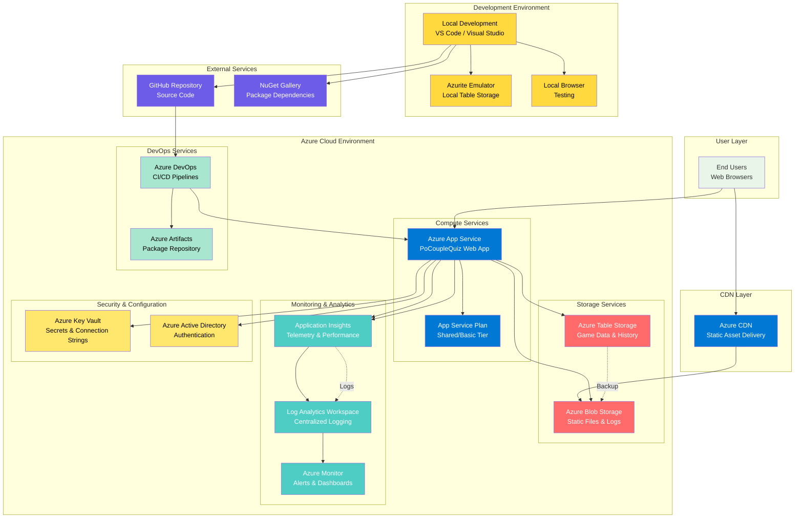

```mermaid
graph TB
    subgraph "User Layer"
        Users[End Users<br/>Web Browsers]
    end
    
    subgraph "CDN Layer"
        CDN[Azure CDN<br/>Static Asset Delivery]
    end
    
    subgraph "Azure Cloud Environment"
        subgraph "Compute Services"
            AppService[Azure App Service<br/>PoCoupleQuiz Web App]
            Plan[App Service Plan<br/>Shared/Basic Tier]
        end
        
        subgraph "Storage Services"
            TableStorage[Azure Table Storage<br/>Game Data & History]
            BlobStorage[Azure Blob Storage<br/>Static Files & Logs]
        end
        
        subgraph "Monitoring & Analytics"
            AppInsights[Application Insights<br/>Telemetry & Performance]
            LogAnalytics[Log Analytics Workspace<br/>Centralized Logging]
            Monitor[Azure Monitor<br/>Alerts & Dashboards]
        end
        
        subgraph "Security & Configuration"
            KeyVault[Azure Key Vault<br/>Secrets & Connection Strings]
            AAD[Azure Active Directory<br/>Authentication]
        end
        
        subgraph "DevOps Services"
            DevOps[Azure DevOps<br/>CI/CD Pipelines]
            Artifacts[Azure Artifacts<br/>Package Repository]
        end
    end
    
    subgraph "Development Environment"
        LocalDev[Local Development<br/>VS Code / Visual Studio]
        Azurite[Azurite Emulator<br/>Local Table Storage]
        LocalBrowser[Local Browser<br/>Testing]
    end
    
    subgraph "External Services"
        GitHub[GitHub Repository<br/>Source Code]
        NuGet[NuGet Gallery<br/>Package Dependencies]
    end
    
    %% User Interactions
    Users --> CDN
    Users --> AppService
    CDN --> BlobStorage
    
    %% Application Dependencies
    AppService --> TableStorage
    AppService --> BlobStorage
    AppService --> AppInsights
    AppService --> KeyVault
    AppService --> AAD
    
    %% Monitoring Flow
    AppService --> AppInsights
    AppInsights --> LogAnalytics
    LogAnalytics --> Monitor
    
    %% Development Flow
    LocalDev --> Azurite
    LocalDev --> LocalBrowser
    LocalDev --> GitHub
    LocalDev --> NuGet
    
    %% CI/CD Flow
    GitHub --> DevOps
    DevOps --> Artifacts
    DevOps --> AppService
    
    %% Resource Relationships
    AppService --> Plan
    
    %% Data Flow
    TableStorage -.Backup.-> BlobStorage
    AppInsights -.Logs.-> LogAnalytics
    
    %% Styling
    classDef user fill:#e8f5e8
    classDef azure fill:#0078d4,color:#ffffff
    classDef storage fill:#ff6b6b,color:#ffffff
    classDef monitoring fill:#4ecdc4,color:#ffffff
    classDef security fill:#ffe66d,color:#000000
    classDef devops fill:#a8e6cf,color:#000000
    classDef local fill:#ffd93d,color:#000000
    classDef external fill:#6c5ce7,color:#ffffff
    
    class Users user
    class AppService,Plan,CDN azure
    class TableStorage,BlobStorage storage
    class AppInsights,LogAnalytics,Monitor monitoring
    class KeyVault,AAD security
    class DevOps,Artifacts devops
    class LocalDev,Azurite,LocalBrowser local
    class GitHub,NuGet external
```
