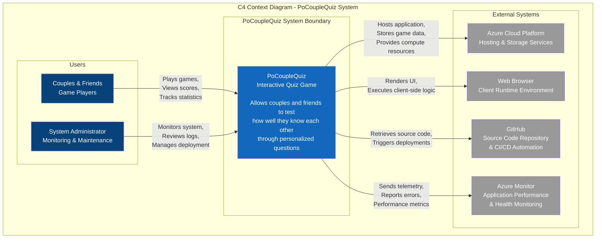

```mermaid
graph TB
    subgraph "C4 Context Diagram - PoCoupleQuiz System"
        
        subgraph "Users"
            Couples[Couples & Friends<br/>Game Players]
            Admin[System Administrator<br/>Monitoring & Maintenance]
        end
        
        subgraph "PoCoupleQuiz System Boundary"
            System[PoCoupleQuiz<br/>Interactive Quiz Game<br/><br/>Allows couples and friends to test<br/>how well they know each other<br/>through personalized questions]
        end
        
        subgraph "External Systems"
            Azure[Azure Cloud Platform<br/>Hosting & Storage Services]
            Browser[Web Browser<br/>Client Runtime Environment]
            GitHub[GitHub<br/>Source Code Repository<br/>& CI/CD Automation]
            Monitor[Azure Monitor<br/>Application Performance<br/>& Health Monitoring]
        end
    end
    
    %% Relationships
    Couples -->|Plays games,<br/>Views scores,<br/>Tracks statistics| System
    Admin -->|Monitors system,<br/>Reviews logs,<br/>Manages deployment| System
    
    System -->|Hosts application,<br/>Stores game data,<br/>Provides compute resources| Azure
    System -->|Renders UI,<br/>Executes client-side logic| Browser
    System -->|Retrieves source code,<br/>Triggers deployments| GitHub
    System -->|Sends telemetry,<br/>Reports errors,<br/>Performance metrics| Monitor
    
    %% Styling
    classDef person fill:#08427b,color:#ffffff
    classDef system fill:#1168bd,color:#ffffff
    classDef external fill:#999999,color:#ffffff
    
    class Couples,Admin person
    class System system
    class Azure,Browser,GitHub,Monitor external
```
