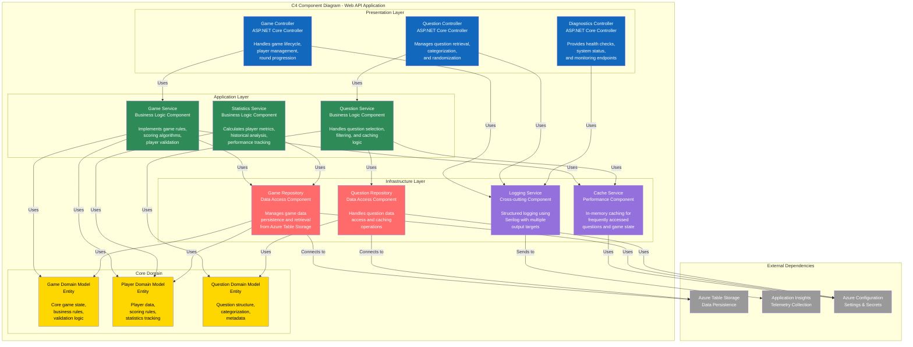

```mermaid
graph TB
    subgraph "C4 Component Diagram - Web API Application"
        
        subgraph "Presentation Layer"
            GameController[Game Controller<br/>ASP.NET Core Controller<br/><br/>Handles game lifecycle,<br/>player management,<br/>round progression]
            
            QuestionController[Question Controller<br/>ASP.NET Core Controller<br/><br/>Manages question retrieval,<br/>categorization,<br/>and randomization]
            
            DiagController[Diagnostics Controller<br/>ASP.NET Core Controller<br/><br/>Provides health checks,<br/>system status,<br/>and monitoring endpoints]
        end
        
        subgraph "Application Layer"
            GameService[Game Service<br/>Business Logic Component<br/><br/>Implements game rules,<br/>scoring algorithms,<br/>player validation]
            
            QuestionService[Question Service<br/>Business Logic Component<br/><br/>Handles question selection,<br/>filtering, and caching<br/>logic]
            
            StatisticsService[Statistics Service<br/>Business Logic Component<br/><br/>Calculates player metrics,<br/>historical analysis,<br/>performance tracking]
        end
        
        subgraph "Infrastructure Layer"
            GameRepository[Game Repository<br/>Data Access Component<br/><br/>Manages game data<br/>persistence and retrieval<br/>from Azure Table Storage]
            
            QuestionRepository[Question Repository<br/>Data Access Component<br/><br/>Handles question data<br/>access and caching<br/>operations]
            
            LoggingService[Logging Service<br/>Cross-cutting Component<br/><br/>Structured logging using<br/>Serilog with multiple<br/>output targets]
            
            CacheService[Cache Service<br/>Performance Component<br/><br/>In-memory caching for<br/>frequently accessed<br/>questions and game state]
        end
        
        subgraph "Core Domain"
            GameModel[Game Domain Model<br/>Entity<br/><br/>Core game state,<br/>business rules,<br/>validation logic]
            
            PlayerModel[Player Domain Model<br/>Entity<br/><br/>Player data,<br/>scoring rules,<br/>statistics tracking]
            
            QuestionModel[Question Domain Model<br/>Entity<br/><br/>Question structure,<br/>categorization,<br/>metadata]
        end
        
    end
    
    subgraph "External Dependencies"
        TableStorage[Azure Table Storage<br/>Data Persistence]
        AppInsights[Application Insights<br/>Telemetry Collection]
        Configuration[Azure Configuration<br/>Settings & Secrets]
    end
    
    %% Controller Dependencies
    GameController -->|Uses| GameService
    GameController -->|Uses| LoggingService
    QuestionController -->|Uses| QuestionService
    QuestionController -->|Uses| LoggingService
    DiagController -->|Uses| LoggingService
    
    %% Service Dependencies
    GameService -->|Uses| GameRepository
    GameService -->|Uses| GameModel
    GameService -->|Uses| PlayerModel
    GameService -->|Uses| CacheService
    
    QuestionService -->|Uses| QuestionRepository
    QuestionService -->|Uses| QuestionModel
    QuestionService -->|Uses| CacheService
    
    StatisticsService -->|Uses| GameRepository
    StatisticsService -->|Uses| PlayerModel
    
    %% Repository Dependencies
    GameRepository -->|Connects to| TableStorage
    GameRepository -->|Uses| GameModel
    GameRepository -->|Uses| PlayerModel
    
    QuestionRepository -->|Connects to| TableStorage
    QuestionRepository -->|Uses| QuestionModel
    
    %% Infrastructure Dependencies
    LoggingService -->|Sends to| AppInsights
    CacheService -->|Uses| Configuration
    GameRepository -->|Uses| Configuration
    QuestionRepository -->|Uses| Configuration
    
    %% Styling
    classDef controller fill:#1168bd,color:#ffffff
    classDef service fill:#2e8b57,color:#ffffff
    classDef repository fill:#ff6b6b,color:#ffffff
    classDef model fill:#ffd700,color:#000000
    classDef infrastructure fill:#9370db,color:#ffffff
    classDef external fill:#999999,color:#ffffff
    
    class GameController,QuestionController,DiagController controller
    class GameService,QuestionService,StatisticsService service
    class GameRepository,QuestionRepository repository
    class GameModel,PlayerModel,QuestionModel model
    class LoggingService,CacheService infrastructure
    class TableStorage,AppInsights,Configuration external
```
