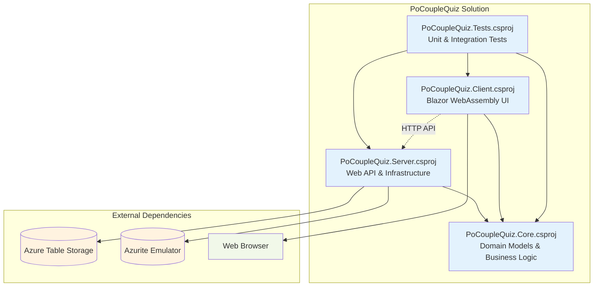

```mermaid
graph TD
    subgraph "PoCoupleQuiz Solution"
        Core[PoCoupleQuiz.Core.csproj<br/>Domain Models & Business Logic]
        Server[PoCoupleQuiz.Server.csproj<br/>Web API & Infrastructure]
        Client[PoCoupleQuiz.Client.csproj<br/>Blazor WebAssembly UI]
        Tests[PoCoupleQuiz.Tests.csproj<br/>Unit & Integration Tests]
    end
    
    subgraph "External Dependencies"
        AzureTable[(Azure Table Storage)]
        Azurite[(Azurite Emulator)]
        Browser[Web Browser]
    end
    
    %% Project Dependencies
    Server --> Core
    Client --> Core
    Tests --> Core
    Tests --> Server
    Tests --> Client
    
    %% External Dependencies
    Server --> AzureTable
    Server --> Azurite
    Client --> Browser
    
    %% API Communication
    Client -.HTTP API.-> Server
    
    %% Styling
    classDef project fill:#e3f2fd
    classDef external fill:#f1f8e9
    classDef storage fill:#fff3e0
    
    class Core,Server,Client,Tests project
    class Browser external
    class AzureTable,Azurite storage
```
