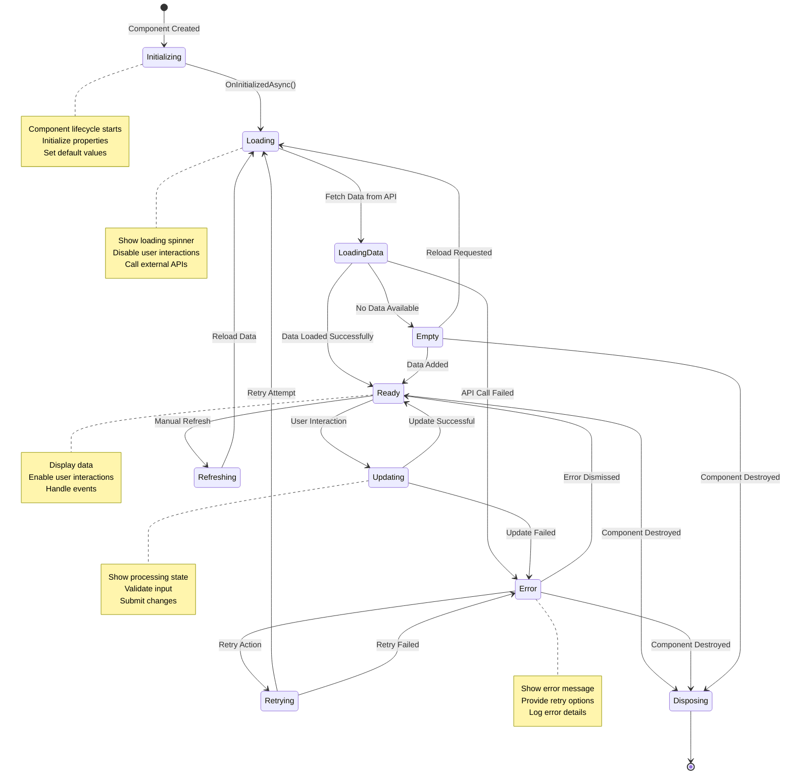

```mermaid
stateDiagram-v2
    [*] --> Initializing : Component Created
    
    Initializing --> Loading : OnInitializedAsync()
    Loading --> LoadingData : Fetch Data from API
    
    LoadingData --> Ready : Data Loaded Successfully
    LoadingData --> Error : API Call Failed
    LoadingData --> Empty : No Data Available
    
    Ready --> Updating : User Interaction
    Ready --> Refreshing : Manual Refresh
    
    Updating --> Ready : Update Successful
    Updating --> Error : Update Failed
    
    Refreshing --> Loading : Reload Data
    
    Error --> Retrying : Retry Action
    Error --> Ready : Error Dismissed
    
    Retrying --> Loading : Retry Attempt
    Retrying --> Error : Retry Failed
    
    Empty --> Loading : Reload Requested
    Empty --> Ready : Data Added
    
    Ready --> Disposing : Component Destroyed
    Error --> Disposing : Component Destroyed
    Empty --> Disposing : Component Destroyed
    Disposing --> [*]
    
    note right of Initializing
        Component lifecycle starts
        Initialize properties
        Set default values
    end note
    
    note right of Loading
        Show loading spinner
        Disable user interactions
        Call external APIs
    end note
    
    note right of Ready
        Display data
        Enable user interactions
        Handle events
    end note
    
    note right of Error
        Show error message
        Provide retry options
        Log error details
    end note
    
    note right of Updating
        Show processing state
        Validate input
        Submit changes
    end note
```
