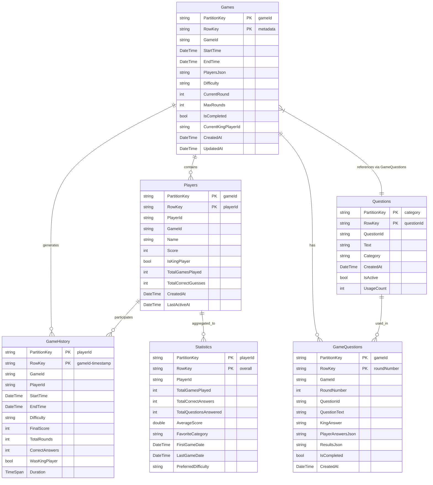

```mermaid
erDiagram
    Games {
        string PartitionKey PK "gameId"
        string RowKey PK "metadata"
        string GameId
        DateTime StartTime
        DateTime EndTime
        string PlayersJson
        string Difficulty
        int CurrentRound
        int MaxRounds
        bool IsCompleted
        string CurrentKingPlayerId
        DateTime CreatedAt
        DateTime UpdatedAt
    }
    
    Questions {
        string PartitionKey PK "category"
        string RowKey PK "questionId"
        string QuestionId
        string Text
        string Category
        DateTime CreatedAt
        bool IsActive
        int UsageCount
    }
    
    GameQuestions {
        string PartitionKey PK "gameId"
        string RowKey PK "roundNumber"
        string GameId
        int RoundNumber
        string QuestionId
        string QuestionText
        string KingAnswer
        string PlayerAnswersJson
        string ResultsJson
        bool IsCompleted
        DateTime CreatedAt
    }
    
    Players {
        string PartitionKey PK "gameId"
        string RowKey PK "playerId"
        string PlayerId
        string GameId
        string Name
        int Score
        bool IsKingPlayer
        int TotalGamesPlayed
        int TotalCorrectGuesses
        DateTime CreatedAt
        DateTime LastActiveAt
    }
    
    GameHistory {
        string PartitionKey PK "playerId"
        string RowKey PK "gameId-timestamp"
        string GameId
        string PlayerId
        DateTime StartTime
        DateTime EndTime
        string Difficulty
        int FinalScore
        int TotalRounds
        int CorrectAnswers
        bool WasKingPlayer
        TimeSpan Duration
    }
    
    Statistics {
        string PartitionKey PK "playerId"
        string RowKey PK "overall"
        string PlayerId
        int TotalGamesPlayed
        int TotalCorrectAnswers
        int TotalQuestionsAnswered
        double AverageScore
        string FavoriteCategory
        DateTime FirstGameDate
        DateTime LastGameDate
        string PreferredDifficulty
    }
    
    %% Relationships
    Games ||--o{ Players : "contains"
    Games ||--o{ GameQuestions : "has"
    Games ||--o{ GameHistory : "generates"
    Questions ||--o{ GameQuestions : "used_in"
    Players ||--o{ GameHistory : "participates"
    Players ||--o{ Statistics : "aggregated_to"
    
    %% Notes
    Games }|--|| Questions : "references via GameQuestions"
```
