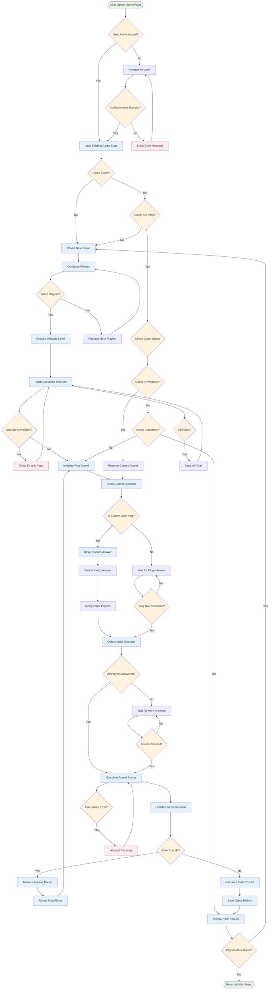

```mermaid
flowchart TD
    Start([User Opens Game Page]) --> CheckAuth{User Authenticated?}
    
    CheckAuth -->|No| Login[Navigate to Login]
    CheckAuth -->|Yes| LoadGame[Load Existing Game State]
    
    Login --> AuthSuccess{Authentication Success?}
    AuthSuccess -->|No| AuthError[Show Error Message]
    AuthSuccess -->|Yes| LoadGame
    AuthError --> Login
    
    LoadGame --> GameExists{Game Exists?}
    GameExists -->|No| CreateGame[Create New Game]
    GameExists -->|Yes| ValidateGame{Game Still Valid?}
    
    ValidateGame -->|No| CreateGame
    ValidateGame -->|Yes| CheckGameState{Check Game Status}
    
    CreateGame --> SetupPlayers[Configure Players]
    SetupPlayers --> ValidatePlayers{Min 2 Players?}
    ValidatePlayers -->|No| AddMorePlayers[Request More Players]
    ValidatePlayers -->|Yes| SelectDifficulty[Choose Difficulty Level]
    
    AddMorePlayers --> SetupPlayers
    
    SelectDifficulty --> LoadQuestions[Fetch Questions from API]
    LoadQuestions --> QuestionsLoaded{Questions Available?}
    QuestionsLoaded -->|No| QuestionError[Show Error & Retry]
    QuestionsLoaded -->|Yes| StartRound[Initialize First Round]
    
    QuestionError --> LoadQuestions
    
    CheckGameState --> InProgress{Game In Progress?}
    InProgress -->|Yes| ContinueGame[Resume Current Round]
    InProgress -->|No| GameComplete{Game Completed?}
    
    GameComplete -->|Yes| ShowResults[Display Final Results]
    GameComplete -->|No| StartRound
    
    StartRound --> DisplayQuestion[Show Current Question]
    ContinueGame --> DisplayQuestion
    
    DisplayQuestion --> IsKing{Is Current User King?}
    IsKing -->|Yes| KingAnswers[King Provides Answer]
    IsKing -->|No| WaitForKing[Wait for King's Answer]
    
    KingAnswers --> KingSubmit[Submit King's Answer]
    KingSubmit --> NotifyOthers[Notify Other Players]
    NotifyOthers --> OthersGuess[Others Make Guesses]
    
    WaitForKing --> KingAnswered{King Has Answered?}
    KingAnswered -->|No| WaitForKing
    KingAnswered -->|Yes| OthersGuess
    
    OthersGuess --> AllAnswered{All Players Answered?}
    AllAnswered -->|No| WaitForAnswers[Wait for More Answers]
    AllAnswered -->|Yes| CalculateScores[Calculate Round Scores]
    
    WaitForAnswers --> Timeout{Answer Timeout?}
    Timeout -->|Yes| CalculateScores
    Timeout -->|No| WaitForAnswers
    
    CalculateScores --> UpdateScoreboard[Update Live Scoreboard]
    UpdateScoreboard --> CheckRounds{More Rounds?}
    
    CheckRounds -->|Yes| NextRound[Advance to Next Round]
    CheckRounds -->|No| FinalizeGame[Calculate Final Results]
    
    NextRound --> RotateKing[Rotate King Player]
    RotateKing --> StartRound
    
    FinalizeGame --> SaveResults[Save Game History]
    SaveResults --> ShowResults
    ShowResults --> PlayAgain{Play Another Game?}
    
    PlayAgain -->|Yes| CreateGame
    PlayAgain -->|No| End([Return to Main Menu])
    
    %% Error Handling
    LoadQuestions --> APIError{API Error?}
    APIError -->|Yes| RetryAPI[Retry API Call]
    RetryAPI --> LoadQuestions
    
    CalculateScores --> ScoreError{Calculation Error?}
    ScoreError -->|Yes| ErrorRecovery[Attempt Recovery]
    ErrorRecovery --> CalculateScores
    
    %% Styling
    classDef startEnd fill:#e8f5e8
    classDef decision fill:#fff3e0
    classDef process fill:#e3f2fd
    classDef error fill:#ffebee
    
    class Start,End startEnd
    class CheckAuth,AuthSuccess,GameExists,ValidateGame,CheckGameState,ValidatePlayers,QuestionsLoaded,InProgress,GameComplete,IsKing,KingAnswered,AllAnswered,Timeout,CheckRounds,PlayAgain,APIError,ScoreError decision
    class LoadGame,CreateGame,SetupPlayers,SelectDifficulty,LoadQuestions,StartRound,DisplayQuestion,KingAnswers,OthersGuess,CalculateScores,UpdateScoreboard,NextRound,RotateKing,FinalizeGame,SaveResults,ShowResults process
    class AuthError,QuestionError,ErrorRecovery error
```
