# PoCoupleQuiz Documentation

This folder contains comprehensive documentation for the PoCoupleQuiz project.

## Contents

### Product Requirements
- **[PRD.md](PRD.md)**: Product Requirements Document with features, user stories, and technical requirements

### Architecture Decision Records (ADRs)
The `adr/` folder contains Architecture Decision Records documenting key architectural choices:

1. [Use Serilog for Structured Logging](adr/001-use-serilog-for-structured-logging.md)
2. [Use Azure Table Storage for Data Persistence](adr/002-use-azure-table-storage.md)
3. [Use Azure Key Vault References for Application Secrets](adr/003-use-key-vault-references-for-secrets.md)
4. [Use Radzen Blazor for UI Components](adr/004-use-radzen-blazor-components.md)
5. [Use Vertical Slice Architecture](adr/005-use-vertical-slice-architecture.md)

### Architecture Diagrams
The `diagrams/` folder contains Mermaid diagrams (`.mmd` files) that visualize the system architecture:

- **c4-context.mmd**: C4 Context diagram showing system users and external dependencies
- **c4-container.mmd**: C4 Container diagram showing application components and their interactions
- **sequence-game-flow.mmd**: Sequence diagram showing the complete game flow from start to finish
- **sequence-health-check.mmd**: Sequence diagram showing the health check flow for the diagnostics page
- **deployment-architecture.mmd**: Deployment architecture showing local development and Azure infrastructure

## Building Diagrams

To convert Mermaid diagrams (`.mmd`) to SVG images:

### Prerequisites
```powershell
# Install Node.js dependencies
npm install
```

### Generate SVG Diagrams
```powershell
# Generate all diagrams
npm run build-diagrams

# Watch for changes and auto-regenerate
npm run watch-diagrams
```

This will create `.svg` files in the `diagrams/` folder alongside the `.mmd` source files.

## Viewing Diagrams

### In VS Code
Install the [Mermaid Preview extension](https://marketplace.visualstudio.com/items?itemName=vstirbu.vscode-mermaid-preview) to preview `.mmd` files directly in VS Code.

### In Markdown Files
Reference the generated SVG files in your markdown documentation:

```markdown

```

### Online
Paste the contents of `.mmd` files into the [Mermaid Live Editor](https://mermaid.live/) for interactive editing and rendering.

## Documentation Standards

### ADRs
When creating new ADRs, follow this structure:
1. **Status**: Accepted | Proposed | Deprecated | Superseded
2. **Context**: What is the issue that we're seeing?
3. **Decision**: What is the change that we're proposing?
4. **Rationale**: Why are we making this decision?
5. **Consequences**: What are the positive and negative outcomes?
6. **Alternatives Considered**: What other options were evaluated?
7. **References**: Links to relevant resources

### Diagrams
- Use Mermaid syntax for all diagrams to enable version control and easy editing
- Keep diagrams focused—one concept per diagram
- Use consistent color schemes and styling
- Include titles and legends where appropriate
- Update diagrams when architecture changes

## Contributing

When adding new documentation:
1. Place ADRs in `adr/` with sequential numbering
2. Place diagrams in `diagrams/` with descriptive filenames
3. Update this README.md to reference new content
4. Run `npm run build-diagrams` to generate SVG files
5. Commit both `.mmd` source files and generated `.svg` files

## Additional Resources

- [Mermaid Documentation](https://mermaid.js.org/)
- [C4 Model Documentation](https://c4model.com/)
- [ADR Template](https://github.com/joelparkerhenderson/architecture-decision-record)
